# 🔒 Setup and Use a Firewall on Windows

## 📌 Project Overview
In this project, I explored how to configure **Windows Defender Firewall** by creating custom inbound and outbound rules. My main goal was to block a **Telnet connection over port 8080** and then test the firewall behavior by simulating client-server communication between my PC and smartphone.

This hands-on exercise helped me understand:
- How to create and manage firewall rules.
- The difference between inbound and outbound rules.
- How to test firewall configurations using real TCP connections.

---

## 🛠 Steps I Followed

### 1. Opening Firewall Advanced Settings
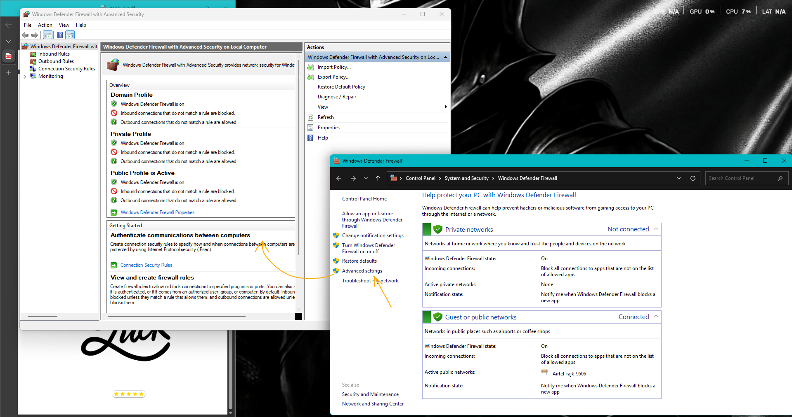

- Opened **Windows Defender Firewall**.
- Navigated to **Advanced Settings**.
- Selected **Outbound Rules** to create a new rule.

### 2. Creating a Custom Outbound Rule
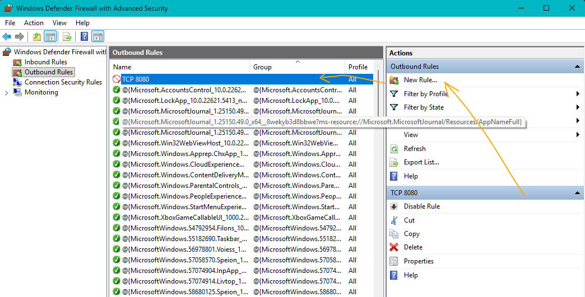
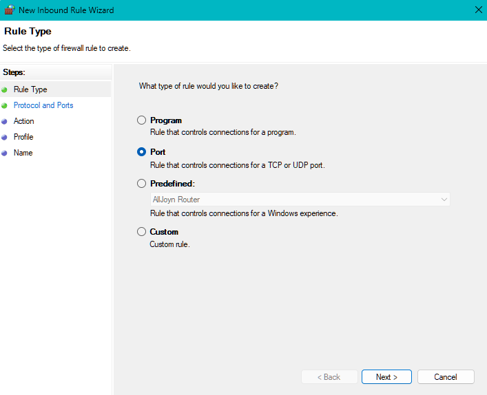
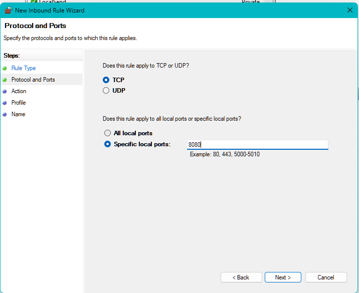
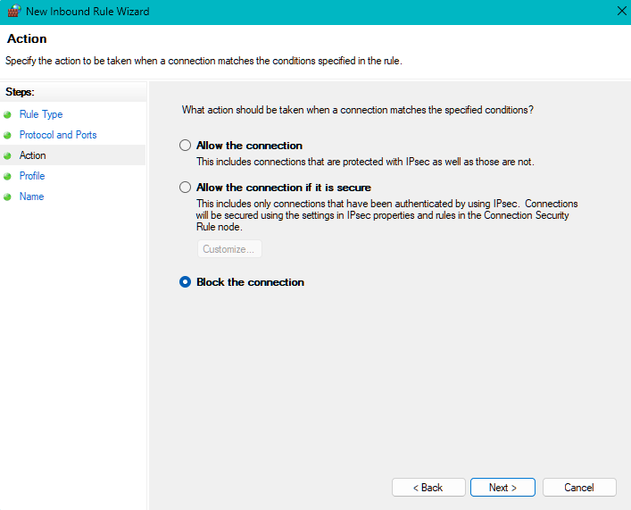
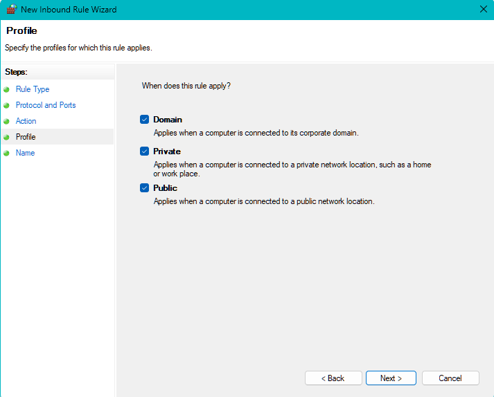
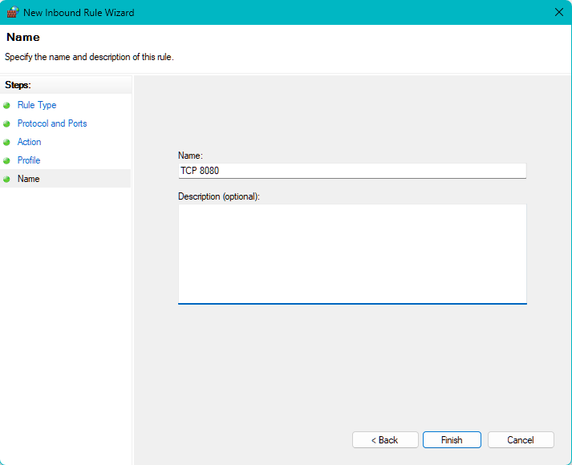

- Defined a new rule to **block Telnet traffic on port 8080**.
- (Note: Port 23 is the default Telnet port, but it was already used by my router, so I chose port 8080.)

### 3. Enabling Telnet Client on Windows
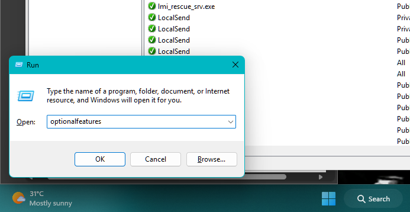
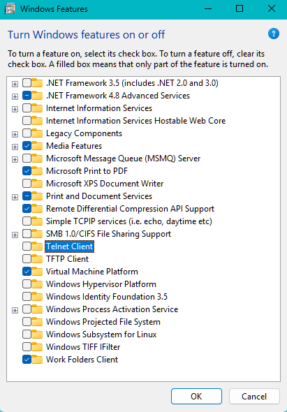
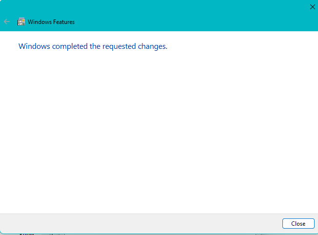

- Pressed `Win + R` → typed `optionalfeatures` → hit Enter.
- Checked the box for **Telnet Client** (disabled by default for security reasons).
- Clicked **OK** to install.

### 4. Setting Up the Test Environment
- My PC IP: `192.168.1.11`
- My smartphone IP: `192.168.1.54`
- Installed a **TCP Server & Client testing app** on my phone.
- Ran the app in **Server Mode**, listening on port **8080**.
  
### 5. Testing the Firewall Rule
- On my PC, opened **Command Prompt**.
- Tried connecting to my phone using: telnet 192.168.1.54 8080
- The connection **failed** (blocked by the firewall rule ✅).
- 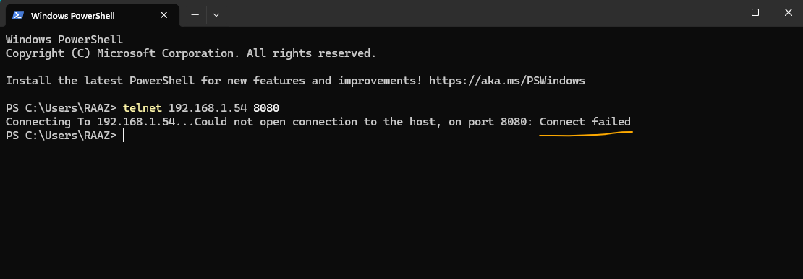

### 6. Confirming the Rule Behavior
- Disabled the outbound rule named **TCP 8080**.
- 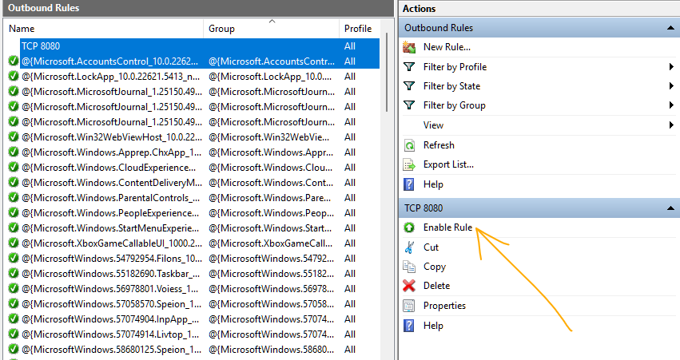
- Retried the same Telnet command.
- This time, the connection was **successful** 🎉.
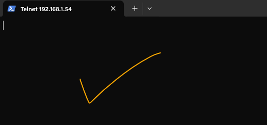

---

## 📚 Key Learnings
- How to create and manage **inbound/outbound rules** in Windows Defender Firewall.
- Practical testing of firewall rules using **Telnet and TCP connections**.
- Understanding how firewall rules directly affect network communication.

---

## 🚀 Conclusion
This project gave me hands-on experience with Windows Firewall configuration and testing. By simulating real client-server communication, I confirmed how firewall rules work in practice. This knowledge is directly applicable to **system hardening, network defense, and incident response scenarios**.

  
